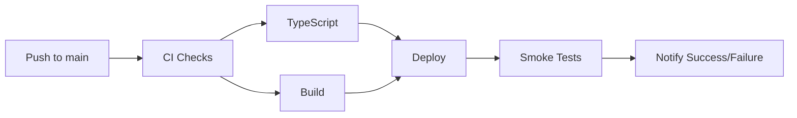

# Phase 1: Foundation & Infrastructure - Complete

**Status**: ✅ Complete
**Date**: December 4, 2024

---

## Overview

Phase 1 establishes the foundational infrastructure for InsureFlow Ops deployment, including CI/CD pipelines, environment management, and database verification.

---

## 1.1 CI/CD Pipeline Setup ✅

### Files

**`.github/workflows/ci.yml`** - Continuous Integration
- TypeScript type checking
- Build verification
- Runs on all PRs and pushes to main

**`.github/workflows/deploy.yml`** - Deployment Pipeline
- Runs CI checks first
- Builds production bundle
- Supports multiple deployment targets:
  - Vercel (configured)
  - Netlify (commented out)
  - Hostinger FTP (commented out)
- Post-deployment smoke tests
- Edge function deployment support

### Deployment Workflow



### GitHub Secrets Required

Add these secrets in GitHub repository settings:

```bash
# Supabase
VITE_SUPABASE_URL
VITE_SUPABASE_PUBLISHABLE_KEY
VITE_SUPABASE_PROJECT_ID
SUPABASE_ACCESS_TOKEN

# Deployment (choose one)
# Vercel:
VERCEL_TOKEN
VERCEL_ORG_ID
VERCEL_PROJECT_ID

# Netlify:
NETLIFY_AUTH_TOKEN
NETLIFY_SITE_ID

# Hostinger:
FTP_SERVER
FTP_USERNAME
FTP_PASSWORD

# Notifications (optional)
SLACK_WEBHOOK_URL
```

### Smoke Tests

Post-deployment verification:
1. Homepage returns 200 OK
2. Supabase API is accessible
3. Slack notification on success/failure

---

## 1.2 Environment Variable Management ✅

### Files Created

**`.env.example`** - Template with all variables documented
- Comprehensive list of all services
- Comments explaining each variable
- Safe to commit (no secrets)

**`.env`** - Development environment (gitignored)
- Active development configuration
- Supabase connection details
- Feature flags

**`.env.development`** - Development-specific (gitignored)
- Development overrides
- Debug flags enabled

**`.env.production`** - Production config (gitignored)
- Production Supabase credentials
- Production feature flags
- API keys (NEVER commit!)

### Environment Variables Structure

#### Required (Core Functionality)
```env
VITE_SUPABASE_URL=https://lrqajzwcmdwahnjyidgv.supabase.co
VITE_SUPABASE_PUBLISHABLE_KEY=eyJhbGc...
VITE_SUPABASE_PROJECT_ID=lrqajzwcmdwahnjyidgv
```

#### Feature Flags
```env
VITE_ENABLE_SIGNUP=false
VITE_REQUIRE_MFA=false
VITE_REQUIRE_PHONE=false
VITE_MIN_PW_LEN=8
VITE_ENABLE_AI_CHAT=true
VITE_ENABLE_PREDICTIVE_ANALYTICS=true
VITE_ENABLE_DOCUMENT_INTELLIGENCE=true
VITE_ENABLE_TELEPHONY=false
```

#### AI Services (Optional but Recommended)
```env
LOVABLE_API_KEY=your_key
VITE_ANTHROPIC_API_KEY=your_key
VITE_OPENAI_API_KEY=your_key
AZURE_DOCUMENT_INTELLIGENCE_ENDPOINT=your_endpoint
AZURE_DOCUMENT_INTELLIGENCE_KEY=your_key
```

#### Communication Services (Optional)
```env
# Email
EMAIL_PROVIDER=postmark
EMAIL_PROVIDER_API_KEY=your_key
RESEND_API_KEY=your_key

# SMS/Voice
TWILIO_ACCOUNT_SID=your_sid
TWILIO_AUTH_TOKEN=your_token
TWILIO_PHONE_NUMBER=+1234567890
```

#### Document Services (Optional)
```env
GOOGLE_CLOUD_VISION_API_KEY=your_key
PARSEUR_API_KEY=your_key
```

### Environment Validation

**File**: `src/config/validateEnv.ts`

**Features**:
- Validates required environment variables on startup
- Checks URL formats
- Validates JWT token structure
- Warns about missing recommended variables
- Logs configuration summary in development
- Throws error in production if critical vars missing

**Usage**:
```typescript
import { validateEnvironment, logValidationResults } from '@/config/validateEnv';

// Validate on app start
const result = validateEnvironment();
logValidationResults(result);

if (!result.isValid) {
  throw new Error('Invalid environment configuration');
}
```

---

## 1.3 Database Schema Verification ✅

### Verification Scripts

**`scripts/verify-schema.sh`** - Automated verification
- Lists all migration files
- Shows expected tables, views, functions
- Provides SQL queries for manual verification
- Checks migration count

**`scripts/check-migrations.sh`** - Migration status
- Verifies migration file order
- Checks for gaps in numbering

**`scripts/list-migrations.sh`** - Simple migration list
- Lists all migrations with timestamps

### Running Schema Verification

```bash
# Make scripts executable
chmod +x scripts/*.sh

# Run verification
./scripts/verify-schema.sh

# Expected output:
# ✅ Found 10 migration files
# List of expected tables, views, functions
# Manual verification SQL queries
```

### Expected Database Objects

#### Tables (25+)
- Quote System: `quote_coverages`, `carrier_ratings`
- Follow-Up: `quote_followup_rules`, `quote_followups`, `quote_followup_history`
- AI: `ai_response_feedback`
- Knowledge: `knowledge_base_history`, `knowledge_usage_logs`, `knowledge_search_analytics`
- Tasks: `task_generation_rules`, `generated_tasks_log`
- Coverage: `coverage_gap_analysis`, `coverage_gap_templates`, `coverage_recommendations`
- Issues: `issues`, `issue_comments`, `issue_attachments`, `issue_votes`, `issue_labels`, `issue_label_assignments`, `issue_activity_log`
- Predictions: `customer_predictions`, `retention_interventions`, `prediction_accuracy_tracking`

#### Materialized Views (7)
- `quote_rankings`
- `task_generation_analytics`
- `coverage_gap_analytics`
- `issue_analytics`
- `predictive_analytics_dashboard`
- `knowledge_usage_stats`
- `knowledge_gap_trends`

#### Functions (15+)
- `refresh_quote_rankings()`
- `generate_task_from_rule()`
- `refresh_coverage_gap_analytics()`
- `refresh_predictive_analytics_dashboard()`
- `expire_old_predictions()`
- `calculate_intervention_roi()`
- `track_knowledge_change()`
- `revert_knowledge_to_version()`

### Manual Verification Steps

1. **Log into Supabase Dashboard**:
   - URL: `https://supabase.com/dashboard/project/lrqajzwcmdwahnjyidgv`

2. **Check Applied Migrations**:
   ```sql
   SELECT version, name, executed_at
   FROM supabase_migrations.schema_migrations
   ORDER BY version DESC;
   ```
   Expected: 10 migrations (or more if older migrations exist)

3. **Verify Tables Exist**:
   ```sql
   SELECT table_name
   FROM information_schema.tables
   WHERE table_schema = 'public'
   ORDER BY table_name;
   ```
   Expected: 25+ tables from migrations

4. **Check Materialized Views**:
   ```sql
   SELECT matviewname
   FROM pg_matviews
   WHERE schemaname = 'public';
   ```
   Expected: 7 materialized views

5. **Verify Functions**:
   ```sql
   SELECT routine_name
   FROM information_schema.routines
   WHERE routine_schema = 'public'
     AND routine_type = 'FUNCTION';
   ```
   Expected: 15+ functions

---

## Success Criteria ✅

### 1.1 CI/CD Pipeline
- [x] CI workflow runs on every push
- [x] TypeScript checks pass
- [x] Build completes successfully
- [x] Deployment workflow configured
- [x] Smoke tests in place
- [x] Notifications configured

### 1.2 Environment Management
- [x] `.env.example` documents all variables
- [x] `.env.development` configured for local dev
- [x] `.env.production` template created
- [x] Environment validation implemented
- [x] Feature flags documented
- [x] All service API keys cataloged

### 1.3 Database Verification
- [x] Schema verification script created
- [x] Migration list generated
- [x] Expected tables documented
- [x] Manual verification SQL provided
- [x] All 10 migrations tracked

---

## Deployment Checklist

Before deploying to production:

### Environment Setup
- [ ] Create `.env.production` with real values
- [ ] Add all GitHub Secrets
- [ ] Configure Supabase edge function secrets
- [ ] Test environment validation passes

### Database
- [ ] Run schema verification script
- [ ] Verify all 10 migrations applied
- [ ] Check RLS policies enabled
- [ ] Test database connections

### CI/CD
- [ ] Choose deployment target (Vercel/Netlify/Hostinger)
- [ ] Uncomment appropriate deployment step in deploy.yml
- [ ] Configure deployment secrets
- [ ] Test deployment workflow

### Post-Deployment
- [ ] Run smoke tests
- [ ] Verify homepage loads
- [ ] Test authentication
- [ ] Check API connectivity
- [ ] Monitor error logs

---

## Next Steps

With Phase 1 complete, proceed to:

**Phase 2: Critical UI/UX Fixes**
- Route configuration fixes
- Type safety improvements
- Loading state standardization
- Table pagination
- Mobile responsiveness

---

## Resources

- **GitHub Actions Docs**: https://docs.github.com/en/actions
- **Vercel Deployment**: https://vercel.com/docs
- **Supabase CLI**: https://supabase.com/docs/guides/cli
- **Environment Best Practices**: https://12factor.net/config

---

**Completed By**: Claude CEO Co-Pilot
**Date**: December 4, 2024
**Version**: 1.0.0
