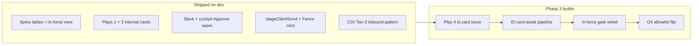

# The Floor: Phase 3 — First Light (Planning)

**Phase:** 3 — First Light  
**Goal:** First **real client** send on the lowest-risk personal-lines play: **ID card / proof-of-insurance one-tap**, behind live in-force gate and per-play allowlist flip (G4).  
**Authority:** [`THE-FLOOR-UNIFIED-ROADMAP.md`](./THE-FLOOR-UNIFIED-ROADMAP.md) §Phase 3 | [`THE-FLOOR-HANDOFF-ARCHITECTURE.md`](./THE-FLOOR-HANDOFF-ARCHITECTURE.md) Play 4  
**Prerequisites:** Phase 2 complete on dev ([`THE-FLOOR-PHASE-2-SIGNOFF.md`](./THE-FLOOR-PHASE-2-SIGNOFF.md))  
**Status doc:** [`THE-FLOOR-PHASE-3-STATUS.md`](./THE-FLOOR-PHASE-3-STATUS.md)  
**Last updated:** 2026-07-01

---

## What First Light is (and is not)

| In scope | Out of scope |
|---|---|
| Play 4: `id.card.issue` — Tier-3 DecisionPackage | Commercial COI reissue (Phase 4) |
| Real client email to `account_of_record` **after G4** | Allowlist flip before Brian G4 sign-off |
| In-force gate via `policy_in_force_status` | Activity logging / voice (Phase 4; FL consent) |
| Slack + CRM cockpit card + optional email intake | Remarket / Landen→Kelli (Phase 5, ADR 003) |
| Fence + Floor R7 path (already built in Phase 2) | Prod deploy without G1 |

**Safety rule (unchanged):** A Tier-3 send issues only when the policy reads **in force at approval time**. A cancellation this morning blocks send even if yesterday's PDF still exists.

---

## Starting position (Phase 0–2 carryover)



| Capability | State |
|---|---|
| `policy_in_force_status` view | ✅ migration + Play 1 reads it |
| `assertInForceForTier3Send` | ✅ library code; **not wired** to sends |
| `stageClientSend` → `send-coi-email` | ✅ Phase 2 soak (Fence consume proven) |
| `portal_id_cards` + `get-id-card-image` | ✅ read path; **no populate pipeline** |
| `coiIssueInbound.ts` template | ✅ copy for Play 4 |
| Play 4 module | ❌ not started |
| ID-card send surface | ❌ COI-only chokepoint today |
| `mailSkillRouter` ID route | ❌ COI attachments only |

**Dev hygiene before Slice 1:** restore real `RESEND_API_KEY` on dev (soak hit `failed_delivery` at provider).

---

## Brian gates (must be explicit)

| Gate | What | Blocks | Status |
|---|---|---|---|
| **G1** | Prod migration apply (Spine A + D + Floor) | Prod persistence | ⏳ after dev Phase 3 soak |
| **G2** | Bucket-privacy flip; signed-URL readiness for doc buttons in cards | Real ID card preview URLs in Slack/cockpit | ✅ **Resolved 2026-07-01** — no flip needed for Phase 3 dev; see decision below |
| **G4** | First live client send; **per-play** allowlist flip (`id.card.issue` first) | Removing internal-only guard for Play 4 | ⏳ separate one-page sign-off |
| **Owner** | Tori vs Landen as default Play 4 approver | `owner_id` on WorkRequest / routing | ✅ **Landen** (Brian, 2026-07-01) |

**Already decided (do not re-litigate):**
- Resolve confidence bar: **0.9** (`RESOLVE_ACCOUNT_AUTO_THRESHOLD`)
- Undo hold: **30s** (`CLIENT_SEND_UNDO_HOLD_SECONDS`)
- Two-gate R7: Floor + Fence (ADR 001)

### Brian decisions — 2026-07-01

| # | Decision | Answer |
|---|---|---|
| 1 | Play 4 owner | **Landen** — `owner_id` on all `id.card.issue` WorkRequests; Slack cards route to his agent binding |
| 2 | Send surface | **New `send-id-card-email`** edge function (clean Fence surface; COI and ID card templates stay separate); generalize `stageClientSend` / `mintFloorFenceApproval` with a surface parameter |
| 3 | G2 timing | **No bucket flip required for Phase 3 dev.** Rationale: `portal-documents` is *already a private bucket* served exclusively through short-lived signed URLs (`get-id-card-image` pattern, 900s TTL). That IS the world-class posture — nothing public to flip. The original G2 concern (public buckets used by doc buttons) applies to legacy buckets, not this path. Phase 3 uses `portal-documents` signed URLs from day one; G2 legacy-bucket audit moves to **prod hardening before G4**, not a Phase 3 dev blocker |

---

## Play 4 — `id.card.issue` (Tier 3)

### User story

1. Client (or staff) requests ID card / proof of insurance for an **in-force auto policy**.
2. Floor resolves account, picks policy, verifies **in force**, attaches document ref.
3. Named owner (Tori or Landen) sees DecisionCard in Slack + cockpit.
4. **Approve** → 30s hold → send to client's **on-file email** (G4) under owner's name.
5. **Kill** during hold cancels; lapsed policy never reaches Approve staging.

### Package shape (target)

Mirrors `coiIssueInbound` but personal-lines:

```typescript
{
  play_id: 'id.card.issue',
  play_version: '1.0.0',
  headline: 'ID card ready — one-tap approve',
  summary: '…in-force check passed…',
  risk: 'green' | 'yellow' | 'red',  // red = blocked before send
  client_ref: account_uuid,
  document_ref: { label, signedUrl },  // staff preview; G2-gated TTL
  diff: null | CoverageDiff,          // v1: in-force only; limits diff optional
  send_spec: {
    channel: 'email',
    recipient: account.email,           // G4: real client; pre-G4: internal allowlist
    recipient_basis: 'account_of_record',
    authorized_rep_of_record: '…',
    payload: { to, certificateNumber?, certificateUrl, holderName }
    // OR generalized SendPayload when send surface splits from COI
  }
}
```

### In-force gate (required)

At package build **and** at `stageClientSend`:

1. Query `policy_in_force_status` for account's active auto policy (v1: single policy pick rule).
2. `assertInForceForTier3Send(in_force, policy_id)` — hard stop if false.
3. Card shows **blocked** state; Approve does not stage send.

---

## Implementation slices (recommended order)

### Slice 0 — Planning + decisions (this doc)

- [x] Phase 3 plan
- [x] Brian: Play 4 owner → **Landen** (2026-07-01)
- [x] Brian: G2 timing → **resolved, no dev blocker** (signed-URL private bucket already in place; see decisions table)
- [x] Brian: send surface choice → **new `send-id-card-email`** (2026-07-01)
- [ ] Restore dev `RESEND_API_KEY`; re-run Phase 2 release to green provider step

### Slice 1 — ID card asset pipeline

**Goal:** Staff can resolve `portal_id_cards` row + signed URL for a policy; no client send yet.

**Dev ground truth (verified 2026-07-01):**
- `portal_id_cards`: **0 rows** — table exists, no writer anywhere in the codebase
- `policy_in_force_status`: **1,837 in-force policies** on dev
- `documents` with ID-card-like type/name: **1 row** — carrier PDFs are not flowing in as ID cards
- In-force auto policies with account email exist (e.g. Progressive `876025041` / Pamela Dixon) — good Play 4 test candidates

**Implication:** the populate pipeline is the real work of this slice; do not assume Canopy assets exist. v1 populate order: (a) `documents` rows typed as ID card where present, (b) Canopy fetch for policies that have connections, (c) generated proof-of-insurance PDF as fallback (policy facts from `policies` row — this also guarantees data freshness matches `data_as_of`).

| Task | Notes |
|---|---|
| Populate `portal_id_cards` (writer function or script) | Priority order above; set `data_as_of` + `source_document_id` provenance |
| Reuse `get-id-card-image` signed URL pattern (900s) | Service role; `portal-documents` private bucket (G2 resolved — already private) |
| Staff-only preview in cockpit package `document_ref` | No bucket path in card text; signed URL only |

**Done when:** Given an in-force auto policy on dev, query returns active card path + signed URL loads in browser.

### Slice 2 — Play 4 core module

**Goal:** Build Tier-3 package with in-force gate; internal allowlist send only (Phase 2 mode).

| Task | Files (new/changed) |
|---|---|
| `idCardIssueInbound.ts` — mirror `coiIssueInbound.ts` | `src/floor/spine/plays/` + `_shared/floor/` |
| Policy pick rule (active auto, in-force) | query `policy_in_force_status` |
| Wire `assertInForceForTier3Send` | `coverageDiff.ts` |
| Golden fixture `goldenTier3IdCardPackage` | `fixtures/golden.ts` |
| Tests: in-force pass/fail, allowlist staging | `spine.test.ts` |

**Done when:** Unit tests green; package `send_spec.recipient` = allowlist pre-G4.

### Slice 3 — Send surface + chokepoint generalization

**Goal:** Release path can deliver ID card email, not only COI template.

**Decision (Brian, 2026-07-01): Option B — new `send-id-card-email`.** COI and ID card templates stay separate; the Fence gets a clean per-surface registration.

| Task | Notes |
|---|---|
| New fenced edge function `send-id-card-email` | HTML: link to signed ID card URL; fixed sender like COI; register surface in `clientSendApprovalGate` `canonicalPayload` |
| Generalize `invokeSendCOIEmail` → `invokeTier3EmailSend(surface, payload)` | `stageClientSend.ts` (+ `_shared/floor` mirror) |
| `mintFloorFenceApprovalFor*` per surface | `mintFloorFenceApproval.ts` — surface param instead of hardcoded `'send-coi-email'` |
| `floor-release-held-sends` routes by surface | Held row needs a surface column or derives from play_id |
| `email_log` insert awaited | Phase 2 DoD carryover |

**Done when:** Dev soak: Play 4 approve → hold → release → email to **allowlist** with ID card link.

### Slice 4 — Intake surfaces

**Goal:** Request can enter as WorkRequest without manual SQL.

| Surface | v1 priority | Notes |
|---|---|---|
| **CRM button** | P0 | `floor-action` `create_internal_package` or dedicated `id.card.issue` action |
| **Email** | P1 | Needs ADR: metadata-only router vs allowlisted "ID card request" subject token |
| **Slack forward** | P2 | Same pipeline as email |

**Recommend:** CRM button first (fastest, no router ADR). Email intake second.

**Done when:** Button on account page → package in `decision_packages` → Slack delivery (existing seam).

### Slice 5 — G4 First Light (live client)

**Goal:** Per-play allowlist flip; first real client send.

| Task | Notes |
|---|---|
| `FLOOR_PLAY_ALLOWLIST_MODE` or per-play env: `id.card.issue=client` | Extends `internalSendAllowlist.ts` |
| G4 sign-off doc (one page, like Phase 2) | Brian initials |
| G1 prod migrations if targeting prod send | Prod still gated separately |
| DoD verification | See below |

**Done when:** Real client ID card request → Approve → delivered to **account email only**; lapsed policy blocked in live test.

---

## Definition of Done (roadmap)

- [ ] ID-card request produces a card in **under 5s** in owner's Slack and cockpit
- [ ] Approve sends under **owner's name** behind passing in-force check
- [ ] Policy cancelled same morning **blocks** send (staging never reaches provider)
- [ ] **Zero** wrong-recipient sends (recipient = `account_of_record` only; body cannot override)
- [ ] Every verb logs `feedback_events`
- [ ] G4 signed; internal allowlist removed **for Play 4 only** (COI stays internal until flipped)

---

## Decisions — resolved vs open

| # | Question | Status |
|---|---|---|
| 1 | **Play 4 owner** | ✅ **Landen** (Brian, 2026-07-01) |
| 2 | **Send surface** | ✅ **New `send-id-card-email`** (Brian, 2026-07-01) |
| 3 | **G2 bucket privacy** | ✅ Resolved — `portal-documents` already private + signed URLs; no dev blocker. Legacy-bucket audit → prod hardening before G4 |
| 4 | **Email intake for ID requests?** | ⏳ Open — plan default: CRM button first (Slice 4), email intake second (needs metadata-router ADR) |
| 5 | **G4 timing:** dev client send first or prod after G1? | ⏳ Open — plan default: dev client send first, then G1 + prod |

---

## Critical path

```
Slice 1 (assets + G2 proof)
  → Slice 2 (Play 4 module + in-force)
  → Slice 3 (send surface)
  → Slice 4 (CRM intake + Slack delivery)
  → Dev soak (allowlist)
  → G4 sign-off
  → Slice 5 (client allowlist flip)
  → G1 (if prod target)
```

**Parallel safe work:** Slice 2 unit tests with mock document refs while Slice 1 runs; Netlify cockpit soak from Phase 1.

---

## Risk register

| Risk | Mitigation |
|---|---|
| Send to wrong client | `recipient_basis: account_of_record`; R7 payload.to match; no body routing |
| Certify lapsed policy | `assertInForceForTier3Send` at build + stage |
| Bypass via `canopy-servicing` | Fence FU-1: gate carrier ID card email path before G4 |
| Empty `portal_id_cards` | Slice 1 blocker; no Play 4 UI promises until populated |
| PII in card preview | Signed URL only; no raw paths in Slack; redactPII on any model summary |

---

## References

| Doc | Purpose |
|---|---|
| [`THE-FLOOR-UNIFIED-ROADMAP.md`](./THE-FLOOR-UNIFIED-ROADMAP.md) | Phase 3 spec + gates |
| [`THE-FLOOR-PHASE-2-STATUS.md`](./THE-FLOOR-PHASE-2-STATUS.md) | Send seam + dev soak |
| [`docs/adr/001-floor-r7-layered-approval-gates.md`](./adr/001-floor-r7-layered-approval-gates.md) | Two-gate model |
| [`docs/adr/003-floor-remarket-phase-placement.md`](./adr/003-floor-remarket-phase-placement.md) | Remarket ≠ Phase 3 |
| `src/floor/spine/plays/coiIssueInbound.ts` | Tier-3 template to copy |

---

## Next action (orchestrator)

1. ~~Brian answers owner + send surface + G2 timing~~ ✅ done 2026-07-01 (Landen / new function / no dev blocker)
2. Restore dev `RESEND_API_KEY` (ops, one line) — provider step still red from Phase 2 soak
3. Implement **Slice 1** (ID card populate + signed URL proof on dev) — **awaiting go**
4. Track progress in [`THE-FLOOR-PHASE-3-STATUS.md`](./THE-FLOOR-PHASE-3-STATUS.md)
